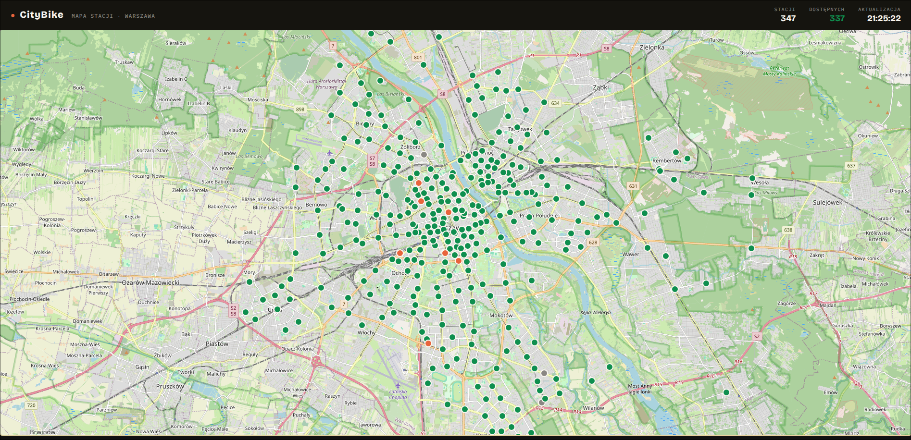
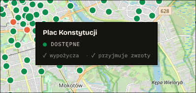
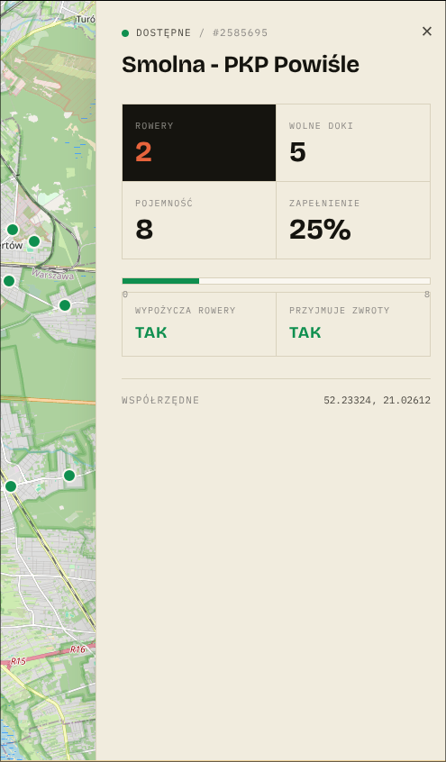

# CityBike

A full-stack web app that shows a live map of Nextbike (Veturilo) bike-sharing stations in Warsaw. The Spring Boot backend pulls the public **GBFS** feed every minute, merges the static station info with the live status, and serves it through a small REST API. The React + OpenLayers frontend renders the stations on an OSM map with hover tooltips and a details panel.






---

## Features

- **Live data** — backend polls the Nextbike GBFS API every 60 seconds and stores the merged result in MariaDB.
- **Two-endpoint merge** — combines `station_information.json` (static: name, location, capacity) with `station_status.json` (live: bikes available, docks, renting/returning flags) by `station_id`.
- **REST API** with endpoints for all stations, a single station, stations with free docks, and stations with bikes available.
- **Interactive map** built with OpenLayers + OpenStreetMap tiles, centered on Warsaw.
- **Auto-refresh** — the frontend also re-fetches every 60 seconds to stay in sync.
- **CORS-configured** for local development between `:5173` (frontend) and `:8080` (backend).

## Tech stack

**Backend**
- Java 21, Spring Boot 4.0.6
- Spring Web MVC, Spring Data JPA
- MariaDB (JDBC)
- Lombok, Jackson
- Java `HttpClient` for outgoing GBFS calls, `@Scheduled` for the 60s poll

**Frontend**
- React 18
- Vite 5
- OpenLayers 10 (`ol`)
- Vanilla CSS

## Project structure

```
CityBike-master/
├── pom.xml                          # Maven config (Spring Boot 4, Java 21)
├── mvnw, mvnw.cmd                   # Maven wrapper
├── src/
│   ├── main/
│   │   ├── java/com/rdhxb/CityBike/
│   │   │   ├── CityBikeApplication.java
│   │   │   ├── config/WebConfig.java           # CORS
│   │   │   ├── controller/BikeStationController.java
│   │   │   ├── bikeService/StationService.java
│   │   │   ├── bikeRepo/StationRepo.java
│   │   │   ├── entity/Station.java
│   │   │   └── DataCollector/
│   │   │       ├── DataInitializer.java        # @Scheduled GBFS fetcher
│   │   │       ├── StationInfo.java            # DTO for station_information
│   │   │       └── StationStatus.java          # DTO for station_status
│   │   └── resources/application.properties
│   └── test/...
└── citybike-frontend/
    ├── package.json
    ├── vite.config.js
    ├── .env                          # VITE_API_URL
    ├── index.html
    └── src/
        ├── main.jsx
        ├── App.jsx
        ├── styles.css
        ├── hooks/useStations.js      # fetches /api/stations every 60s
        ├── components/
        │   ├── MapView.jsx
        │   ├── StationDetailsPanel.jsx
        │   └── StationTooltip.jsx
        └── utils/stationStyles.js
```

## Prerequisites

- **Java 21+**
- **Maven** (or use the included `./mvnw` wrapper)
- **MariaDB** running locally on port `3306`
- **Node.js 18+** and **npm**

## Setup

### 1. Database

Create the database that the backend expects:

```sql
CREATE DATABASE CityBikeDb;
```

The default credentials in `src/main/resources/application.properties` are `root` / `root`. Adjust them if your MariaDB setup differs:

```properties
spring.datasource.url=jdbc:mariadb://localhost:3306/CityBikeDb
spring.datasource.username=root
spring.datasource.password=root
spring.jpa.hibernate.ddl-auto=update
```

Hibernate will create the `stations` table automatically on first run.

### 2. Backend

From the project root:

```bash
./mvnw spring-boot:run
```

On Windows:

```bash
mvnw.cmd spring-boot:run
```

The API will start on **http://localhost:8080**. The scheduled job kicks in immediately and then runs every 60 seconds, so the database fills up after the first successful fetch.

### 3. Frontend

```bash
cd citybike-frontend
npm install
npm run dev
```

The dev server runs on **http://localhost:5173**. The API URL is configured in `citybike-frontend/.env`:

```
VITE_API_URL=http://localhost:8080
```

## API reference

Base URL: `http://localhost:8080/api/stations`

| Method | Endpoint              | Description                               |
| ------ | --------------------- | ----------------------------------------- |
| GET    | `/`                   | All stations                              |
| GET    | `/{stationId}`        | One station by its GBFS `station_id`      |
| GET    | `/bikes`              | Stations with at least one bike available |
| GET    | `/docks`              | Stations with at least one free dock      |

### Example response

```json
{
  "id": 1,
  "stationId": "247901",
  "name": "Metro Politechnika",
  "lat": 52.2207,
  "lon": 21.0124,
  "capacity": 20,
  "numBikesAvailable": 7,
  "numDocksAvailable": 13,
  "isRenting": true,
  "isReturning": true
}
```

## How it works

1. `DataInitializer.collectMergeSave()` runs on application start and then every 60 seconds (`@Scheduled(fixedRate = 60_000)`).
2. It hits two GBFS endpoints in sequence:
   - `https://gbfs.nextbike.net/maps/gbfs/v2/nextbike_vw/pl/station_information.json`
   - `https://gbfs.nextbike.net/maps/gbfs/v2/nextbike_vw/pl/station_status.json`
3. Both responses are parsed into `StationInfo` and `StationStatus` lists, then merged by `station_id` into a single `Station` entity via `mergeData()`.
4. `StationService.updateIncomingData()` upserts the merged list — new stations are inserted, existing ones are updated in place inside a `@Transactional` block.
5. The React frontend polls `/api/stations` every 60 seconds via the `useStations` hook and re-renders the map markers.

## Configuration notes

- **CORS** — `WebConfig` reads allowed origins from the `app.cors.allowed-origins` property (default `http://localhost:5173`). Override it via an environment variable or `application.properties` if you deploy the frontend elsewhere.
- **Polling rate** — change `fixedRate` in `DataInitializer` and `REFRESH_INTERVAL_MS` in `useStations.js` if you want a different cadence. Be considerate of the public GBFS feed.
- **Different city/operator** — the GBFS URLs in `DataInitializer` are hardcoded for Nextbike PL. Swap them for any other GBFS-compliant feed and the rest of the pipeline should keep working.

## Troubleshooting

- **`Schedule refresh does not work skipping !`** in logs — the GBFS fetch threw an exception (network issue, malformed response, etc.). The scheduler swallows it and will retry on the next tick.
- **Empty map** — confirm the backend is running, the database is reachable, and at least one scheduled fetch has completed. Hit `http://localhost:8080/api/stations` directly to verify.
- **CORS error in browser console** — make sure the frontend origin matches the value in `WebConfig` (default `http://localhost:5173`).

## License

MIT
